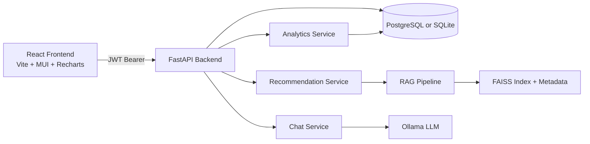

# Full Working Functionality Guide

## 1. Application Summary

This application is an AI-powered workforce staffing platform for:
- employee recommendation for projects,
- bench/utilization analytics,
- project allocation management,
- cross-project staffing suggestions,
- authenticated and role-based workforce operations.

It combines deterministic business logic (analytics, allocation actions) with AI-assisted modules (RAG retrieval, recommendation scoring, LLM chat).

## 2. Technology, Languages, and Runtime

### 2.1 Languages
- Python 3.11 (backend, AI pipeline, tests, data generation)
- JavaScript (React frontend)
- SQL (schema and relational model)
- YAML (Docker Compose)
- Markdown/JSON (documentation and prompts)
- CSS (frontend styling)

### 2.2 Backend Libraries
From requirements.txt:
- fastapi, uvicorn
- pydantic, pydantic-settings
- sqlalchemy, psycopg2-binary
- pandas, numpy, faker, scikit-learn
- langchain, langchain-community, langchain-ollama
- sentence-transformers, faiss-cpu
- httpx
- PyJWT
- psutil
- pytest, pytest-cov

### 2.3 Frontend Libraries
From frontend/package.json:
- react, react-dom
- @mui/material, @emotion/react, @emotion/styled
- recharts
- axios
- vite, @vitejs/plugin-react

### 2.4 Infrastructure
- Docker and Docker Compose for multi-service setup
- PostgreSQL (containerized default DB for Docker flow)
- Ollama (local model serving)
- SQLite support for local/dev and tests

## 3. End-to-End Architecture



## 4. Repository and Folder Structure

The following is the functional structure (excluding very large dependency folders such as node_modules internals):

```text
ai-resource-allocation-rag/
  analytics/
    model_benchmark_runner.py
    workforce_analytics.py
  backend/
    api/
      auth_routes.py
      deps.py
      routes.py
    database/
      init_db.py
      models.py
      session.py
    models/
      schemas.py
    repositories/
      analytics_repository.py
      employee_repository.py
      user_repository.py
    services/
      analytics_service.py
      chat_service.py
      recommendation_service.py
    utils/
      config.py
      exceptions.py
      logging_config.py
      security.py
    main.py
  data/
    employees.csv
    projects.csv
    historical_allocations.csv
    employees.index
    employees_meta.json
    generate_synthetic_data.py
    model_benchmark_results.csv
    model_benchmark_results.json
  deployment/
    deploy_guide.md
    schema.sql
  docs/
    api_documentation.md
    architecture.md
    final_artifacts.md
    limitations_future.md
    model_benchmark_results.md
    model_comparison_report.md
    prompt_engineering_report.md
    setup_and_run_guide.md
    testing_strategy.md
    full_functionality_guide.md
  frontend/
    src/
      components/
        Dashboard.jsx
        EmployeesPage.jsx
        LoginPage.jsx
      services/
        api.js
      App.jsx
      main.jsx
      styles.css
    index.html
    package.json
    vite.config.js
  notebooks/
    model_benchmark.ipynb
  prompts/
    benchmark_prompts.json
    system_prompt.txt
  rag/
    embeddings/
      embedding_generator.py
    ingestion/
      chunking.py
      document_loader.py
      text_cleaner.py
    llm/
      ollama_client.py
    pipelines/
      employee_rag_pipeline.py
    retrieval/
      ranking_engine.py
      retriever.py
    vector_store/
      faiss_manager.py
  recommendation_engine/
    scoring.py
  tests/
    integration/
      test_api.py
    performance/
      test_retrieval_latency.py
    unit/
      test_benchmark_runner.py
      test_rag_chunking.py
      test_scoring.py
      test_security.py
  docker-compose.yml
  Dockerfile
  pytest.ini
  requirements.txt
  README.md
  .env.example
```

## 5. Configuration and Environment

## 5.1 Settings model
Backend settings are centralized in backend/utils/config.py using pydantic BaseSettings.

Primary configurable values:
- APP_ENV, LOG_LEVEL
- POSTGRES_HOST, POSTGRES_PORT, POSTGRES_DB, POSTGRES_USER, POSTGRES_PASSWORD
- DATABASE_URL (overrides PostgreSQL assembled URL)
- JWT_SECRET_KEY, JWT_ALGORITHM, ACCESS_TOKEN_EXPIRE_MINUTES
- OLLAMA_BASE_URL, OLLAMA_MODEL, EMBEDDING_MODEL
- API_HOST, API_PORT

## 5.2 Environment files
- .env.example contains Docker-oriented defaults:
  - DATABASE_URL points to postgres service
  - OLLAMA_BASE_URL points to ollama service

## 5.3 Database selection logic
In backend/database/session.py:
- If DATABASE_URL is set, it is used directly.
- Otherwise, PostgreSQL URL is assembled from POSTGRES_* values.
- If URL starts with sqlite, check_same_thread is set False for SQLite compatibility.

## 6. Data Model and Persistence

Database tables are represented by SQLAlchemy models in backend/database/models.py:

- User
  - username, full_name, password_hash, role, is_active, created_at
- Employee
  - employee_id, name, primary_skill, secondary_skill, years_experience,
    certifications, availability_status, current_utilization, location,
    role, resume_text
- Project
  - project_id, project_name, required_skills, preferred_certifications,
    min_experience, required_headcount, location, domain
- HistoricalAllocation
  - allocation_id, employee_id, project_id, allocation_month,
    allocation_percentage, performance_rating

Relationships:
- Employee <-> HistoricalAllocation (one-to-many)
- Project <-> HistoricalAllocation (one-to-many)

Seed behavior in backend/database/init_db.py:
- Creates schema on startup.
- Seeds users/employees/projects/allocations if tables are empty.
- Uses CSV files in data/.

## 7. Security, Authentication, and Authorization

## 7.1 Password security
In backend/utils/security.py:
- PBKDF2-HMAC SHA256 with random salt.
- 120,000 iterations.
- Constant-time comparison with hmac.compare_digest.

## 7.2 JWT
- Token payload includes subject (sub), role, exp.
- Signed with configured secret and algorithm.

## 7.3 Request authentication
In backend/api/deps.py:
- HTTP Bearer token required for protected routes.
- Token is decoded; user loaded from DB.
- Checks:
  - user exists and active,
  - token role matches DB role.

## 7.4 RBAC
Role guard utility require_roles(allowed_roles) enforces endpoint-level role permissions.

Roles used:
- admin
- manager
- viewer

## 8. Backend Modules and Responsibilities

## 8.1 API layer

- backend/api/auth_routes.py
  - POST /auth/login: returns token + role.
  - GET /auth/me: current user profile.

- backend/api/routes.py
  Main business endpoints for recommendation, chat, workforce analytics, project management, assignment/unassignment, and AI project recommendations.

## 8.2 Repository layer

- EmployeeRepository
  - list(limit), all(), by_ids(employee_ids)
- UserRepository
  - get_by_username(username)
- AnalyticsRepository
  - aggregates and trend calculations from Employee, Project, and HistoricalAllocation

## 8.3 Service layer

- RecommendationService
  - builds/uses RAG index
  - retrieves candidates from vector search
  - applies weighted score model

- ChatService
  - RAG retrieval + LLM answer generation

- AnalyticsService
  - transforms repository aggregates into API response shapes

## 8.4 Utility layer

- config.py for settings
- logging_config.py for global logging format and level
- exceptions.py for custom and generic API exception handlers
- security.py for password and JWT operations

## 9. AI, RAG, and Recommendation Internals

## 9.1 RAG ingestion and indexing
Pipeline: rag/pipelines/employee_rag_pipeline.py

Steps:
1. Load employee documents from CSV or DB records.
2. Clean text to normalized lowercase single-space form.
3. Chunk text with overlap (default size 300 words, overlap 50).
4. Generate embeddings.
5. Build FAISS index and persist index + metadata.

Artifacts:
- data/employees.index
- data/employees_meta.json

## 9.2 Embeddings
In rag/embeddings/embedding_generator.py:
- Preferred: sentence-transformers/all-MiniLM-L6-v2.
- Fallback: deterministic hash embedding backend if model load fails.

## 9.3 Retrieval
- FAISS inner-product search via rag/retrieval/retriever.py.
- Optional availability reranking/filter via rag/retrieval/ranking_engine.py.

## 9.4 Weighted scoring engine
In recommendation_engine/scoring.py:

Weights:
- skill_match: 0.40
- availability: 0.20
- certifications: 0.15
- experience: 0.15
- historical_performance proxy: 0.10

Output fields include:
- match_score (0-100)
- skills_matched
- missing_skills
- upskilling_suggestions
- component_scores

## 9.5 LLM chat
In rag/llm/ollama_client.py + backend/services/chat_service.py:
- prompt sent to Ollama /api/generate
- non-streaming response with timeout handling
- answer grounded by retrieved employee snippets

## 10. API Endpoints and Functional Behavior

## 10.1 Public health
- GET /
  - health check payload with service marker

## 10.2 Auth endpoints
- POST /auth/login
- GET /auth/me

## 10.3 Recommendation and AI chat
- POST /recommend (admin, manager)
  - AI-assisted staffing recommendations with explainable score details.
- POST /chat (admin, manager, viewer)
  - RAG-grounded natural language workforce Q&A.

## 10.4 Employee and analytics endpoints
- GET /employees (admin, manager, viewer)
  - employee directory enriched with latest project context.
- GET /analytics (admin, manager, viewer)
  - top-level workforce metrics and demand signals.
- GET /bench (admin, manager)
  - bench count and bench skill distribution.
- GET /utilization (admin, manager, viewer)
  - overall utilization, role utilization, historical allocation trend.

## 10.5 Project and allocation endpoints
- GET /project-teams (admin, manager, viewer)
  - latest-month project-to-members mapping.

- GET /projects (admin, manager, viewer)
  - project catalog with required skills and allocated counts.

- GET /projects/{project_id}/details (admin, manager, viewer)
  - project card metadata,
  - allocated members,
  - fit_candidates (now AI-driven via RecommendationService),
  - fit candidates include matched skills and recommendation metadata.

- POST /projects/{project_id}/assign (admin, manager)
  - creates allocation for current/latest month,
  - updates employee availability and utilization.

- POST /projects/{project_id}/unassign (admin, manager)
  - removes latest matching allocation for employee/project,
  - recomputes employee utilization from remaining allocations,
  - resets to Available and 0.0 utilization when no active allocations remain.

- POST /projects/{project_id}/ai-recommend-chat (admin, manager, viewer)
  - suggests employees currently allocated to other projects,
  - ranks by skill overlap, utilization, experience,
  - generates LLM answer plus structured suggestion payload.

## 11. Frontend Modules and Functionality

## 11.1 Root composition
- App.jsx manages auth-gated routing between:
  - LoginPage
  - Dashboard
  - EmployeesPage

## 11.2 API client
frontend/src/services/api.js:
- axios instance at http://localhost:8000
- token storage in localStorage
- auto Authorization header management
- 401 handling clears session

Available API wrappers include auth, analytics, employees, projects, assign/unassign, AI recommendation chat, and recommendation calls.

## 11.3 Login page
- Pre-filled demo credentials (manager/manager123)
- On success stores JWT and role
- Error feedback shown with MUI Alert

## 11.4 Dashboard page
Features:
- AI staffing recommendation panel
- Workforce KPI cards
- Bench by Skill chart
- Historical Allocation Trend chart
- Skill Demand chart
- Upcoming Project Demand chart

Data loading:
- getAnalytics() + getUtilization()

Visualization:
- Recharts BarChart and LineChart
- Custom tooltip component
- Month formatting utility

## 11.5 Employees page
Two operational tabs:

1. Employees tab
- searchable, sortable, paginated employee table
- selected employee detail panel
- derived project category grouping for display

2. Projects tab
- searchable, sortable, paginated projects table
- view project details action
- allocated members section with Unassign action
- fit candidates section with Assign action
- AI Recommendation Chat (Cross-Project) section

Project actions refresh behavior:
- assign/unassign triggers data reload (employees + projects)
- selected project details are re-fetched after each mutation

## 12. Utilization and Analytics Calculations

## 12.1 Employee utilization value
- Canonical storage field: Employee.current_utilization (fraction from 0.0 to 1.0).
- This field is initially seeded from data/employees.csv and later updated by allocation actions.
- Important: this is not stored as a 0-100 integer in the database; percentage conversion is applied at API response level for dashboard KPIs.

Mathematically:

- Fraction form:
  - utilization_fraction in [0, 1]
- Percentage form:
  - utilization_percent = utilization_fraction * 100

## 12.2 Assign operation impact on utilization

When POST /projects/{project_id}/assign is called:

1. allocation_percentage is bounded to [1, 100].
2. An allocation row is inserted for the latest allocation month.
3. Employee availability_status is set to Allocated.
4. Employee.current_utilization is updated using max:

- current_utilization = max(previous_utilization, allocation_percentage / 100)

Example:
- previous utilization = 0.45
- new allocation_percentage = 60
- new utilization = max(0.45, 0.60) = 0.60

This design avoids decreasing utilization on assign events.

## 12.3 Unassign operation impact on utilization

When POST /projects/{project_id}/unassign is called:

1. Latest matching allocation row for employee/project is deleted.
2. Remaining allocations for the employee in the latest global month are queried.
3. Utilization is recomputed from the remaining percentages:

- total_utilization = min(1.0, sum(remaining_allocation_percentages) / 100)

4. If remaining allocations exist:
- availability_status remains Allocated
- current_utilization = round(total_utilization, 2)

5. If none remain:
- availability_status = Available
- current_utilization = 0.0

Example:
- remaining allocations in month = [40, 35]
- utilization = min(1.0, (40+35)/100) = 0.75

## 12.4 Backend utilization aggregate used by dashboard

AnalyticsRepository.average_utilization() computes:

- average_utilization = avg(Employee.current_utilization)

AnalyticsService converts this fraction for dashboard display:

- resource_utilization = round(average_utilization * 100, 2)

So if DB average is 0.6789, dashboard KPI shows 67.89%.

## 12.5 Bench calculations and bench chart source

Bench logic is based on a configurable utilization threshold (default 0.2):

- bench_count = count(employees where current_utilization < 0.2)
- bench_percentage = round((bench_count / total_employees) * 100, 2)

Bench by skill chart source:

- Group employees under threshold by primary_skill
- Sort descending by count
- Return top entries

## 12.6 Graph derivation: backend payload to frontend chart models

Frontend pulls:

- GET /analytics
- GET /utilization

Then transforms dictionaries into chart arrays:

1. Bench by Skill (bar)
- Source field: analytics.bench_by_skill
- Transform: Object.entries(...) => [{ skill, count }]

2. Historical Allocation Trend (line)
- Source field: utilization.historical_allocation_trend
- Transform: Object.entries(...) => [{ month, count }]
- Rendering: last 12 points only via trendData.slice(-12)

3. Skill Demand Trend (bar)
- Source field: analytics.skill_demand_trend
- Transform: Object.entries(...) => [{ skill, count }]

4. Upcoming Project Demand (bar)
- Source field: analytics.upcoming_project_demand
- Transform: Object.entries(...) => [{ domain, count }]

## 12.7 Clarification: what the historical line chart actually represents

The Historical Allocation Trend chart is frequently interpreted as utilization trend, but it is not.

It represents:
- count of allocation records per allocation_month from historical_allocations.

It does not represent:
- monthly average utilization,
- utilization percentage over time,
- per-role utilization trend.

So rising line values indicate more allocation records in that month, not necessarily higher individual workload percentages.

## 12.8 UI formatting note for utilization values

Current utilization values are stored as fractions in the database and used as fractions in some workforce cards.
This means some UI spots may display values like 0.73 with a percent symbol if not transformed.

Dashboard KPI is already converted correctly to percentage using backend conversion.
If strict consistency is desired across all screens, all employee/project utilization displays should normalize to:

- display_percent = round(current_utilization * 100, 2)

## 13. Prompt Assets and Benchmarking

## 13.1 Prompt files
- prompts/system_prompt.txt: staffing copilot behavior contract
- prompts/benchmark_prompts.json: prompt set for benchmark runs

## 13.2 Benchmark runner
analytics/model_benchmark_runner.py:
- runs prompts against llama3:8b and phi3:mini
- captures latency, memory delta, token counts, success
- emits:
  - data/model_benchmark_results.csv
  - data/model_benchmark_results.json
  - docs/model_benchmark_results.md

## 14. Testing Strategy and Coverage Areas

Testing framework: pytest (pytest.ini sets pythonpath and testpaths)

## 14.1 Integration tests
- tests/integration/test_api.py
  - health endpoint
  - authenticated analytics
  - RBAC denial checks
  - recommendation endpoint behavior

## 14.2 Unit tests
- tests/unit/test_scoring.py
  - weighted scoring output validity
- tests/unit/test_security.py
  - password hash/verify and JWT create/decode
- tests/unit/test_rag_chunking.py
  - chunking behavior
- tests/unit/test_benchmark_runner.py
  - benchmark artifact generation

## 14.3 Performance test
- tests/performance/test_retrieval_latency.py
  - retrieval pipeline under 5 seconds target

## 15. Deployment and Run Modes

## 15.1 Docker Compose mode
Services:
- postgres
- ollama
- backend
- frontend

Flow:
1. backend container installs dependencies and starts FastAPI.
2. seed and synthetic generation scripts run at startup command.
3. frontend container starts Vite dev server.

## 15.2 Local mode (without Docker)
Typical local workflow:
1. install Python dependencies
2. run synthetic data generation if needed
3. run backend with uvicorn
4. run frontend with npm and Vite
5. ensure Ollama daemon and model are available if AI chat is used

## 15.3 API docs
- Swagger UI: /docs from FastAPI backend

## 16. CORS, Error Handling, and Logging

## 16.1 CORS
Allowed origins include:
- http://localhost:5173
- http://127.0.0.1:5173

## 16.2 Exception handling
- custom RecommendationError to return controlled detail/status
- generic unhandled exception mapped to HTTP 500 with generic detail

## 16.3 Logging
- Python logging configured globally with timestamp, level, logger name, and message.

## 17. Data Files and Their Purpose

- data/employees.csv
  - employee master data used for DB seed and RAG source
- data/projects.csv
  - project demand and requirements
- data/historical_allocations.csv
  - historical staffing allocations
- data/employees.index and employees_meta.json
  - vector index and metadata for retrieval
- data/model_benchmark_results.*
  - benchmark outputs

## 18. Current Functional State Summary

The current implementation includes:
- complete auth + RBAC,
- analytics and visualization,
- AI recommendation and RAG chat,
- employee/project tabbed operations,
- assign and unassign allocation workflow,
- AI-driven fit candidates for project details,
- cross-project AI recommendation chat,
- benchmark and automated tests.

This provides a full-stack, working staffing intelligence platform with both operational controls and AI augmentation.
