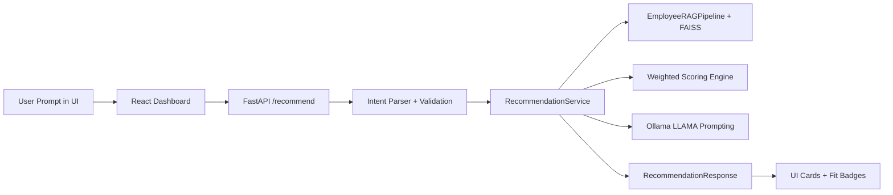
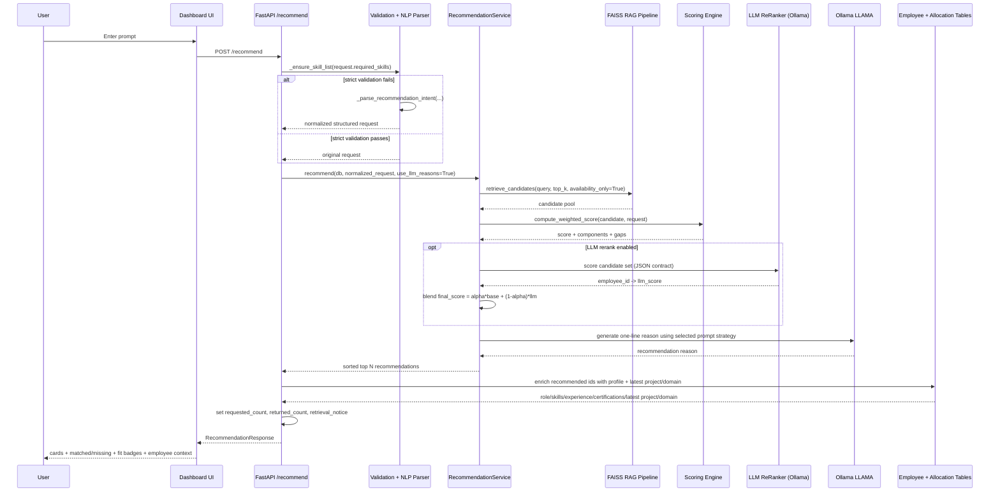
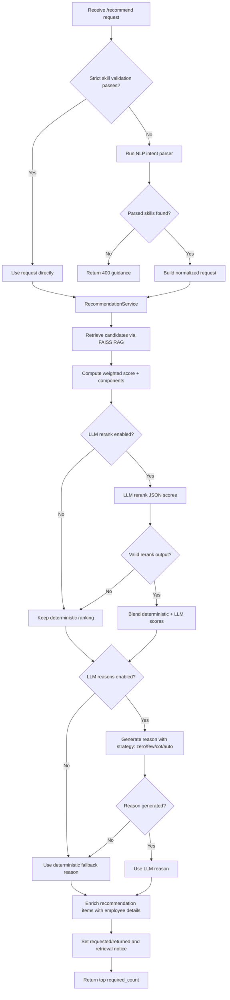
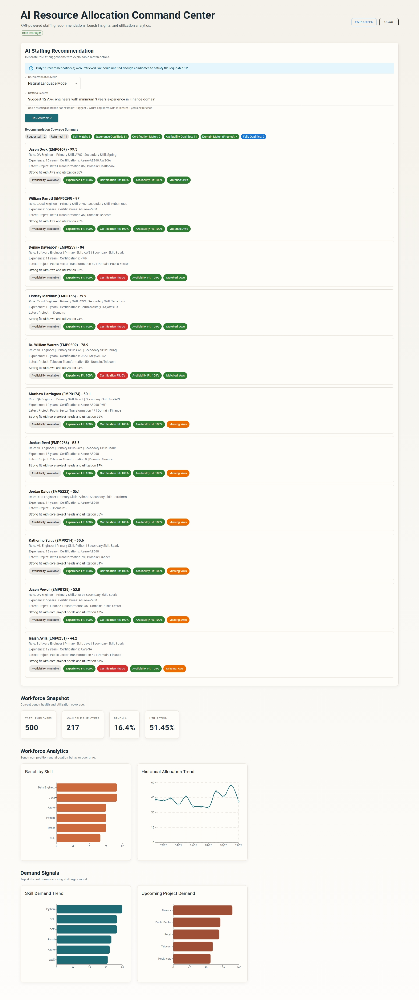

# AI Resource Allocation Command Center

## 1. Purpose

This document explains the end-to-end working flow of the AI Staffing Recommendation feature, including:

- Frontend behavior
- NLP intent parsing
- RAG retrieval internals
- Deterministic scoring and ranking
- Optional LLM reranking blended with deterministic ranking
- LLM reason generation (LLAMA via Ollama)
- Employee detail enrichment for recommendation cards
- Response shaping for UI
- Error handling and fallback behavior

It is focused on the primary workflow triggered from the dashboard recommendation input.

## 2. High-Level Architecture



## 3. Trigger and Input Modes

The dashboard recommendation input supports two practical modes:

1. Skill List Mode
- Input style: comma-separated skills
- Example: `Python, Azure, React`
- Parsed directly as structured `required_skills`

2. Natural Language Mode
- Input style: sentence prompt
- Example: `Suggest 2 Python engineers with minimum 3 years experience`
- Sent to backend where NLP fallback parser extracts structured fields

Auto-detection is also present in frontend submit flow to avoid user errors when mode selector is not changed.

## 4. API Contract Used by Workflow

The recommendation route accepts `RecommendationRequest` with fields:

- `project_name`
- `required_skills`
- `preferred_certifications`
- `min_experience`
- `required_count`
- `location`
- `domain`

The response returns:

- `project_name`
- `requested_count`
- `returned_count`
- `retrieval_notice` (only when returned < requested)
- `recommendations[]`

Each recommendation item includes:

- candidate identity
- `match_score`
- `base_match_score`
- `llm_score`
- `final_score`
- `role`
- `primary_skill`
- `secondary_skill`
- `years_experience`
- `certifications`
- `latest_project_name`
- `latest_project_domain`
- `recommendation_reason`
- `skills_matched`
- `missing_skills`
- `availability`
- `upskilling_suggestions`
- `component_scores`
  - skill_match
  - availability
  - certifications
  - experience
  - historical_performance

## 5. End-to-End Sequence



## 6. Backend Step-by-Step (Detailed)

### Step A: Route-level handling

Route: `POST /recommend`

1. Receive request payload.
2. Attempt strict skill validation (`_ensure_skill_list`).
3. If strict validation fails, run NLP intent parser (`_parse_recommendation_intent`).
4. Call `RecommendationService.recommend(...)` with normalized request.
5. Return response model.

### Step B: NLP intent parser behavior

Input sample:

`Suggest 2 Python engineers with minimum 3 years experience`

Parser extracts:

- `required_skills = ["Python"]`
- `required_count = 2`
- `min_experience = 3`
- optional location/domain only if present in prompt vocabulary

Implemented parsing mechanisms:

- skill aliases dictionary
- regex count extraction (including number + optional tokens + role noun)
- regex experience extraction
- location/domain token matching

### Step C: Candidate retrieval (RAG)

Service composes retrieval query:

`<project_name> requiring <required_skills joined>`

Pipeline internals:

1. Load employee records.
2. Ensure FAISS index files exist.
   - If missing: build index from current employee records.
3. Clean and embed the query text.
4. Vector search top-k chunks from FAISS metadata.
5. Rerank and apply availability filtering (`availability_only=True` in recommendation flow).

Important note:

RAG stage retrieves a relevant candidate pool. It does not produce final ranking score by itself.

### Step D: Deterministic scoring

For each candidate, weighted score is computed using:

- Skill match: 40%
- Availability: 20%
- Certifications: 15%
- Experience: 15%
- Historical utilization/performance proxy: 10%

Returned scoring details include component-level values so UI can display fit badges.

### Step E: LLM reranking (optional, blended)

When enabled, the service asks LLAMA to return strict JSON scores for candidate ids.

Implementation behavior:

1. Preselect candidate subset from deterministic ranking.
2. Prompt model to return JSON array of `{employee_id, llm_score}`.
3. Parse and validate scores (0-100 clamp).
4. Blend scores:
    - `final_score = alpha * base_match_score + (1 - alpha) * llm_score`
5. Use `final_score` as outward `match_score` for sorting.

If JSON is invalid, model times out, or a score is missing, deterministic ranking remains in effect for those candidates.

### Step F: LLM reason generation

If `use_llm_reasons=True`, the service asks LLAMA (Ollama) to produce concise explanation text per candidate.

Prompt engineering supports four strategy values:

- `zero_shot`
- `few_shot`
- `chain_of_thought`
- `auto`

`auto` runs all three and keeps the highest quality reason according to a lightweight quality rubric.

If LLM call fails or returns empty:

- deterministic fallback reason is used.

### Step G: Response enrichment and shortfall notice

After scoring, the route enriches recommendation items with:

- role
- primary/secondary skill
- years of experience
- certifications
- latest project name
- latest project domain

Then it computes response-level metadata:

- `requested_count`
- `returned_count`
- `retrieval_notice` when returned count is below requested count

### Step H: Sorting and truncation

Candidates are sorted by `match_score` descending and truncated to `required_count`.

## 7. Frontend Rendering Path

The dashboard displays recommendation cards with:

- Candidate name and ID
- Overall `match_score`
- Role
- Primary and secondary skill
- Experience
- Certifications
- Latest project and domain
- LLM (or fallback) recommendation sentence
- Availability chip
- Component fit badges:
  - Experience Fit
  - Certification Fit
  - Availability Fit
- Matched skills chips
- Missing skills chips

Coverage summary chips include request/return tracking and criteria-level counters. Domain matching is shown when a domain criterion is present.

The UI therefore presents both qualitative and quantitative recommendation evidence.

## 8. Error and Fallback Behavior

### Validation-level errors

- If input is neither valid skill list nor parseable staffing sentence, API returns 400 with recommendation guidance.

### NLP parser resilience

- Numeric extraction now safely parses integers from matched text to avoid parse crashes.

### LLM unavailability

- Recommendation logic falls back safely:
    - ranking stays deterministic when rerank cannot be applied
    - reason text falls back to deterministic sentence when generation fails

### Network/CORS

- Backend allows common local dev origins on port 5173.
- Frontend API base URL can follow current hostname or env override.

## 9. Workflow With Decision Branches



## 10. Prompt Engineering Summary for This Workflow

Implemented:

- Zero-shot
- Few-shot
- Chain-of-thought style (hidden reasoning instruction)
- Strategy selection via `RECOMMENDATION_PROMPT_STRATEGY`
- `auto` strategy winner selection based on quality rubric

Observed local results (documented in prompt report):

- Few-shot produced most complete reason coverage for experience/certification/utilization mentions.

## 10.1 Effective Use of Prompts (Implemented)

The current implementation uses prompts effectively through explicit constraints, structured output requirements, and fallback logic.

1. Clear role instruction
- Prompts start with explicit assistant identity, for example staffing recommendation assistant or staffing ranking model.

2. Output constraints
- Reason prompts constrain format and length (single concise sentence, under 40 words).
- Rerank prompt enforces machine-readable output (`JSON array`) with fixed keys.

3. Grounding to provided facts
- Prompts explicitly say to use only supplied context and not invent skills/certifications.

4. Strategy diversity
- Multiple styles are implemented (`zero_shot`, `few_shot`, `chain_of_thought`, `auto`) to trade off brevity and completeness.

5. Quality-aware selection
- In `auto`, generated candidates are evaluated by a lightweight rubric and best output is selected.

6. Safety and resilience
- Invalid/empty model outputs are tolerated with deterministic fallback reason and deterministic ranking.

7. Configurability
- Prompt strategy and rerank blending settings are controlled via runtime config flags.

## 10.2 Prompt Templates Used in Code

Below are the practical prompt templates currently used.

### A) Zero-shot reason prompt

```text
You are a staffing recommendation assistant.
Write one concise recommendation sentence for this candidate.
Mention skill fit, experience alignment, certification alignment, and utilization readiness.
Do not invent skills or certifications. Keep response under 40 words.

Project: <project_name>
Required skills: <required_skills>
Preferred certifications: <preferred_certifications>
Minimum experience: <min_experience>
Candidate: <name> (<employee_id>)
Candidate primary skill: <primary_skill>
Candidate secondary skill: <secondary_skill>
Candidate certifications: <certifications>
Candidate experience: <years_experience>
Candidate utilization: <utilization>
Matched skills: <skills_matched>
Missing skills: <missing_skills>
```

### B) Few-shot reason prompt

```text
You are a staffing recommendation assistant. Generate exactly one recommendation sentence.
Keep it factual and under 40 words.

Example 1
Input: Matched skills: Python, Azure | Candidate experience: 9 | Minimum experience: 5 |
Candidate certifications: AWS-SA;Azure-AZ900 | Candidate utilization: 0.22
Output: Strong match for Python/Azure, exceeds the 5-year experience threshold, holds Azure-AZ900,
and is lightly utilized at 22% for near-term allocation.

Example 2
Input: Matched skills: React | Missing skills: Node.js | Candidate experience: 3 | Minimum experience: 4 |
Candidate certifications: ScrumMaster | Candidate utilization: 0.78
Output: Good React alignment but below the 4-year experience target and missing Node.js;
utilization at 78% suggests moderate ramp-up risk.

Now generate output for:
<base candidate/project context>
```

### C) Chain-of-thought-style reason prompt (hidden reasoning)

```text
You are a staffing recommendation assistant.
Think step-by-step internally using this checklist: skills, experience, certifications, utilization.
Do not output the reasoning steps. Output only one final sentence under 40 words.

<base candidate/project context>
```

### D) LLM reranking prompt (JSON contract)

```text
You are a staffing ranking model. Score each candidate from 0 to 100 for this request.
Higher means better fit for allocation priority. Use only provided facts.
Return ONLY a JSON array. No markdown, no commentary.
Each JSON item must be: {"employee_id": "...", "llm_score": number}.

Project: <project_name>
Required skills: <required_skills>
Preferred certifications: <preferred_certifications>
Minimum experience: <min_experience>
Candidates:
1. employee_id=...; name=...; base_match_score=...; skills_matched=...; missing_skills=...; availability=...; experience_fit=...; certification_fit=...
2. ...
```

### E) Chat-service context-grounded prompt

```text
You are a staffing assistant. Use only the given context.
Query: <user_query>
Context:
<retrieved candidate snippets>
Return concise recommendations with reasoning and skill gaps.
```

## 11. Practical Example Walkthrough

Prompt:

`Suggest 2 Python engineers with minimum 3 years experience`

Expected behind-the-scenes normalization:

- required_skills: Python
- required_count: 2
- min_experience: 3
- location/domain: unchanged unless stated

Expected output behavior:

- Returns two top-ranked candidates
- Cards include score + explanation + matched/missing skill chips + fit badges


